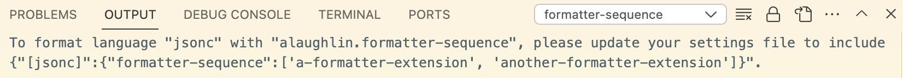

# formatter-sequence README

VSCode only supports a single code formatter, leading to conflicts when running multiple formatters like eslint and prettier. This extension enables running multiple formatters sequentially for simpler configuration and predictability.

## Requirements

Supports the latest vscode version.  No guarantees for earlier versions.

## Extension Settings

```jsonc
// in your settings.json or workspace settings
{
  // configure for a specific language (https://code.visualstudio.com/docs/languages/identifiers#_known-language-identifiers)
  "[typescript]":{
    "editor.defaultFormatter":"alaughlin.formatter-sequence",
    "formatter-sequence":["a-formatter-extension", "another-formatter-extension"]
  }

  // or, configure for all languages (not recommended. Formatters are often language-specific)
  "editor.defaultFormatter":"alaughlin.formatter-sequence",
  "formatter-sequence":["a-formatter-extension", "another-formatter-extension"],
}
```

## Known Issues

Note that extensions can't directly call other formatting extensions. To work around that limitation, this extension updates your config file's "editor.defaultFormatter" with each value from "formatter-sequence", applies it, then sets the defaultFormatter back to "alaughlin.formatter-sequence" afterward.

If you have any issues, first check the extension output for any configuration issues.



## Release Notes

### 0.0.1

Initial release

### 0.0.2

Resolved "This setting cannot be applied because it is not registered as language override setting."

### 0.0.3

Updated this README with changes
